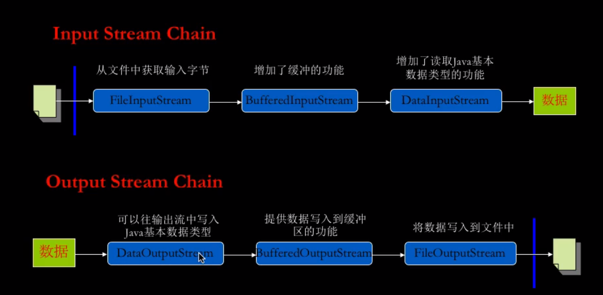
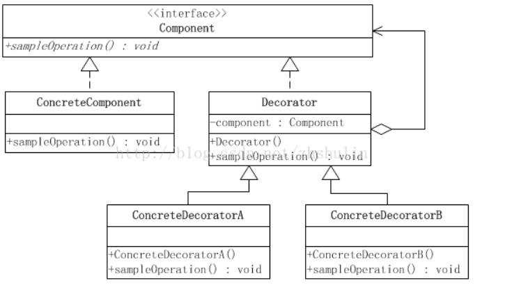

# 流
## 流的分类
### 节点流
>从特定的地方读写的流类，例如：磁盘或一块内存区域
### 过滤流
> 使用**节点流**作为输入或者输出。过滤流是一种一个已经存在的输入流或输出流连接创建的

## I/O流的链接



## 装饰设计模式

>装饰设计模式，可以在原有技能的基础上，新增技能，降低继承所带来的耦合性




```java


/**
 * 装饰模式client
 *
 * BufferedInputSteam  extends FilterInputStream ---- (BufferedInputSteam 相当于ConcreteDecorator2 或者 ConcreteDecorator1 )
 *
 * FilerInputStream extends InputStream ---(FilerInputStream 相当于 Decorator类)
 *
 *  InputStream 相当于 Component
 */

```


