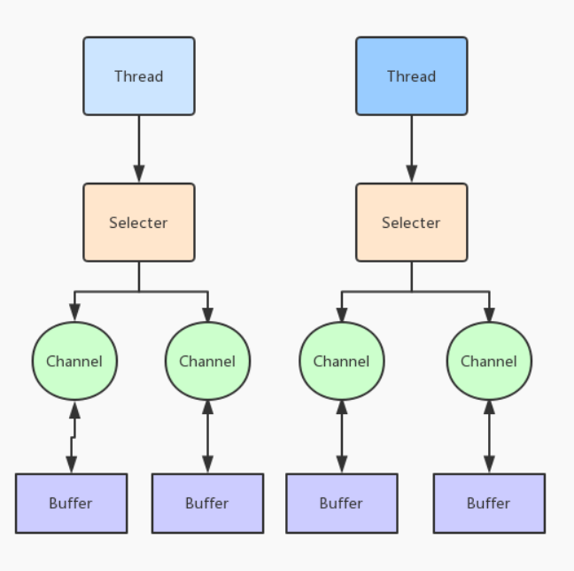

# io 与 nio 核心概念
## io 
> java.io 中最为核心的一个概念是**Stream**,面向流的编程。java中 一个流要么是输入流，要么是输出流，不可能同时既是输入流又是输出流
## nio
> java.nio中拥有三个核心概念：**Selector，Channel，Buffer**。在java.nio中，我们是面向块(**block**)或是缓冲区(**buffer**)编程的。Buffer本身就是一块内存，底层是线上，它实际上是个**数组**，数据的读、写都是通过Buffer来实现的。

> 除了数组之外，Buffer 还提供了对于数据的结构化访问方式，并且可以追踪到系统的读写过程。
 
> Java中的7种原生数据类型都有各自的Buffer类型，如IntBuffer，LongBuffer，ByteBuffer及CharBuffer等，并没有BooleanBuffer类型。

> Channel指的是可以向其他数据或是从中读取数据的对象，它类似于java.io的Stream

> 所有数据的读写都是通过Buffer来进行的，永远不会出现直接向Channel写入数据的情况，或是直接从Channle读取数据的情况。

> 与Stream不同的是，channel是双向的，一个流只可能是InputStream或是OutputStream，channle打开后则可以进行读取、写入或是读写。

> 由于channel是双向的，因此它能更好的反映出底层操作系统的真实情况；在linux系统中，底层操作系统的通道就是双向的。

## Selector、channel、Buffer 之间关系


## Buffer 三个重要状态属性
> 三个重要状态属性含义：**position、limit、capacity**

0<=mark <=position <= limit <= capacity

clear 方法 会 将limit 设置成 capacity ， 以及 设置position为0 具体的**Additional operations** 可以在如下注释中找到：

### java doc 中注释说明

```java
/**
 * A container for data of a specific primitive type.
 *
 * <p> A buffer is a linear, finite sequence of elements of a specific
 * primitive type.  Aside from its content, the essential properties of a
 * buffer are its capacity, limit, and position: </p>
 *
 * <blockquote>
 *
 *   <p> A buffer's <i>capacity</i> is the number of elements it contains.  The
 *   capacity of a buffer is never negative and never changes.  </p>
 *
 *   <p> A buffer's <i>limit</i> is the index of the first element that should
 *   not be read or written.  A buffer's limit is never negative and is never
 *   greater than its capacity.  </p>
 *
 *   <p> A buffer's <i>position</i> is the index of the next element to be
 *   read or written.  A buffer's position is never negative and is never
 *   greater than its limit.  </p>
 *
 * </blockquote>
 *
 * <p> There is one subclass of this class for each non-boolean primitive type.
 *
 *
 * <h2> Transferring data </h2>
 *
 * <p> Each subclass of this class defines two categories of <i>get</i> and
 * <i>put</i> operations: </p>
 *
 * <blockquote>
 *
 *   <p> <i>Relative</i> operations read or write one or more elements starting
 *   at the current position and then increment the position by the number of
 *   elements transferred.  If the requested transfer exceeds the limit then a
 *   relative <i>get</i> operation throws a {@link BufferUnderflowException}
 *   and a relative <i>put</i> operation throws a {@link
 *   BufferOverflowException}; in either case, no data is transferred.  </p>
 *
 *   <p> <i>Absolute</i> operations take an explicit element index and do not
 *   affect the position.  Absolute <i>get</i> and <i>put</i> operations throw
 *   an {@link IndexOutOfBoundsException} if the index argument exceeds the
 *   limit.  </p>
 *
 * </blockquote>
 *
 * <p> Data may also, of course, be transferred in to or out of a buffer by the
 * I/O operations of an appropriate channel, which are always relative to the
 * current position.
 *
 *
 * <h2> Marking and resetting </h2>
 *
 * <p> A buffer's <i>mark</i> is the index to which its position will be reset
 * when the {@link #reset reset} method is invoked.  The mark is not always
 * defined, but when it is defined it is never negative and is never greater
 * than the position.  If the mark is defined then it is discarded when the
 * position or the limit is adjusted to a value smaller than the mark.  If the
 * mark is not defined then invoking the {@link #reset reset} method causes an
 * {@link InvalidMarkException} to be thrown.
 *
 *
 * <h2> Invariants </h2>
 *
 * <p> The following invariant holds for the mark, position, limit, and
 * capacity values:
 *
 * <blockquote>
 *     {@code 0} {@code <=}
 *     <i>mark</i> {@code <=}
 *     <i>position</i> {@code <=}
 *     <i>limit</i> {@code <=}
 *     <i>capacity</i>
 * </blockquote>
 *
 * <p> A newly-created buffer always has a position of zero and a mark that is
 * undefined.  The initial limit may be zero, or it may be some other value
 * that depends upon the type of the buffer and the manner in which it is
 * constructed.  Each element of a newly-allocated buffer is initialized
 * to zero.
 *
 *
 * <h2> Additional operations </h2>
 *
 * <p> In addition to methods for accessing the position, limit, and capacity
 * values and for marking and resetting, this class also defines the following
 * operations upon buffers:
 *
 * <ul>
 *
 *   <li><p> {@link #clear} makes a buffer ready for a new sequence of
 *   channel-read or relative <i>put</i> operations: It sets the limit to the
 *   capacity and the position to zero.  </p></li>
 *
 *   <li><p> {@link #flip} makes a buffer ready for a new sequence of
 *   channel-write or relative <i>get</i> operations: It sets the limit to the
 *   current position and then sets the position to zero.  </p></li>
 *
 *   <li><p> {@link #rewind(重放)} makes a buffer ready for re-reading the data that
 *   it already contains: It leaves the limit unchanged and sets the position
 *   to zero.  </p></li>
 *
 *   <li><p> {@link #slice} creates a subsequence of a buffer: It leaves the
 *   limit and the position unchanged. </p></li>
 *
 *   <li><p> {@link #duplicate} creates a shallow copy of a buffer: It leaves
 *   the limit and the position unchanged. </p></li>
 *
 * </ul>
 *
 *
 * <h2> Read-only buffers </h2>
 *
 * <p> Every buffer is readable, but not every buffer is writable.  The
 * mutation methods of each buffer class are specified as <i>optional
 * operations</i> that will throw a {@link ReadOnlyBufferException} when
 * invoked upon a read-only buffer.  A read-only buffer does not allow its
 * content to be changed, but its mark, position, and limit values are mutable.
 * Whether or not a buffer is read-only may be determined by invoking its
 * {@link #isReadOnly isReadOnly} method.
 *
 *
 * <h2> Thread safety </h2>
 *
 * <p> Buffers are not safe for use by multiple concurrent threads.  If a
 * buffer is to be used by more than one thread then access to the buffer
 * should be controlled by appropriate synchronization.
 *
 *
 * <h2> Invocation chaining </h2>
 *
 * <p> Methods in this class that do not otherwise have a value to return are
 * specified to return the buffer upon which they are invoked.  This allows
 * method invocations to be chained; for example, the sequence of statements
 *
 * <blockquote><pre>
 * b.flip();
 * b.position(23);
 * b.limit(42);</pre></blockquote>
 *
 * can be replaced by the single, more compact statement
 *
 * <blockquote><pre>
 * b.flip().position(23).limit(42);</pre></blockquote>
 *
 *
 * @author Mark Reinhold
 * @author JSR-51 Expert Group
 * @since 1.4
 */
```

### flip()源码介绍
```java
  /**
     * Flips this buffer.  The limit is set to the current position and then
     * the position is set to zero.  If the mark is defined then it is
     * discarded.
     *
     * <p> After a sequence of channel-read or <i>put</i> operations, invoke
     * this method to prepare for a sequence of channel-write or relative
     * <i>get</i> operations.  For example:
     *
     * <blockquote><pre>
     * buf.put(magic);    // Prepend header
     * in.read(buf);      // Read data into rest of buffer
     * buf.flip();        // Flip buffer
     * out.write(buf);    // Write header + data to channel</pre></blockquote>
     *
     * <p> This method is often used in conjunction with (和....搭配使用) the {@link
     * java.nio.ByteBuffer#compact compact(压缩)} method when transferring data from
     * one place to another.  </p>
     *
     * @return  This buffer
     */
    public Buffer flip() {
        limit = position;
        position = 0;
        mark = -1;
        return this;
    }
```

### clear() 方法 
> 状态迁移 好像是 clear 
```java
 /**
     * Clears this buffer.  The position is set to zero, the limit is set to
     * the capacity, and the mark is discarded.
     *
     * <p> Invoke this method before using a sequence of channel-read or
     * <i>put</i> operations to fill this buffer.  For example:
     *
     * <blockquote><pre>
     * buf.clear();     // Prepare buffer for reading
     * in.read(buf);    // Read data</pre></blockquote>
     *
     * <p> This method does not actually erase(擦除) the data in the buffer, but it
     * is named as if it did because it will most often be used in situations
     * in which that might as well be the case. </p>
     *
     * @return  This buffer
     */
    public Buffer clear() {
        position = 0;
        limit = capacity;
        mark = -1;
        return this;
    }
```
### 通过NIO读取文件步骤
> 涉及**3**个步骤

- 从FileInputStream 获取到FileChannle 对象
- 创建Buffer
- 将数据从Channel读取到Buffer中

##### 简单demo

```java
package com.qjx.nio;

import java.io.FileInputStream;
import java.io.FileOutputStream;
import java.nio.ByteBuffer;
import java.nio.channels.FileChannel;

public class NioTest4 {
    public static void main(String[] args) throws Exception {
        FileInputStream inputStream = new FileInputStream("input.txt");
        FileOutputStream outputStream = new FileOutputStream("output.txt");

        FileChannel inputChannel = inputStream.getChannel();

        FileChannel outputChannel = outputStream.getChannel();

        ByteBuffer byteBuffer = ByteBuffer.allocate(512);

        while (true) {
            byteBuffer.clear();  // 如果注释掉会导致 第二次循环时 position和limit值相同，进而导致read方法无法读取新数据 进而导致 read返回值为0 而非-1 最后导致项目一直死循环，文件中一个写入buffer中相同值

            int read = inputChannel.read(byteBuffer);

            System.out.println("read:" + read);

            if(-1 ==read){
                break;
            }

            byteBuffer.flip();

            outputChannel.write(byteBuffer);


        }

        inputChannel.close();
        outputChannel.close();

    }
}
```


### 绝对方法与相对方法含义

* 相对方法
> limit值与position值会在操作时被考虑到
    > 读取/写入元素，读取/transfer多少个元素，则相对的position元素也会发生transfer个位置变化
    > 转换元素大小超出了limit大小则get操作抛出BufferUnderflowException(运行时异常)，put操作会抛出BufferOverflowException ，并且没有数据传输出去

* 绝对方法
> 忽略到limit值与position值
> 直接给定的index进行put or get相应的操作，如果put or get 操作中的这个index 超出了limit的大小 会超出IndexOutOfBoundsException


